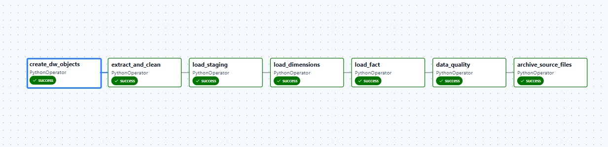
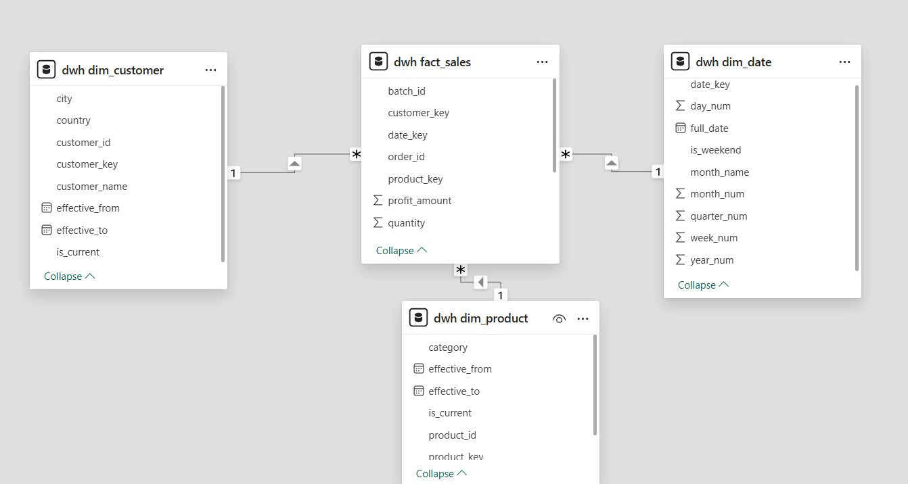
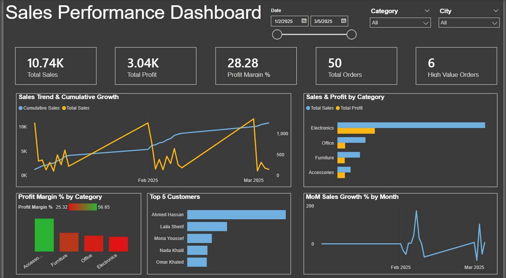

# Retail Sales ETL Pipeline

An end-to-end data engineering project that extracts retail sales data from CSV files, transforms and cleans it with Python and pandas, loads it into a PostgreSQL data warehouse, and automates the workflow using Apache Airflow.

Designed with production-like practices including staging layer, SCD Type 2, and data quality validation.

---

## Tech Stack

| Tool | Purpose |
|---|---|
| Python + Pandas | Data extraction, cleaning, and transformation |
| PostgreSQL | Data Warehouse |
| Apache Airflow | Workflow orchestration and scheduling |
| Docker / Astro CLI | Containerized local environment |
| Power BI | Interactive sales dashboard |
| SQL | Schema creation and warehouse loading |

---

## Architecture

```
        CSV Files
            │
            ▼
   Python (Pandas)
   Cleaning & Transform
            │
            ▼
      Staging Layer
      (staging.stg_sales)
            │
            ▼
     Data Warehouse
   (Star Schema - DWH)
            │
            ▼
     Power BI Dashboard
        (Analytics)

        ─────────────
        Apache Airflow
        (Orchestration)
```

---

## Airflow DAG — All Tasks Success



| Task | Description |
|---|---|
| `create_dw_objects` | Creates schemas and tables if they do not exist |
| `extract_and_clean` | Reads CSV files, cleans data, calculates derived columns |
| `load_staging` | Loads cleaned batch into `staging.stg_sales` |
| `load_dimensions` | Loads dimensions and applies SCD Type 2 logic |
| `load_fact` | Loads rows into `dwh.fact_sales` using surrogate keys |
| `data_quality` | Validates row counts, NULLs, and orphan keys |
| `archive_source_files` | Moves processed CSV files to `data/archive/` |

---

## Data Warehouse Schema (Star Schema)



### Staging Schema
| Table | Description |
|---|---|
| `staging.stg_sales` | Raw cleaned data with `row_num`, `source_file`, `batch_id` |

### DWH Schema
| Table | Description |
|---|---|
| `dwh.dim_customer` | Customer dimension — SCD Type 2 |
| `dwh.dim_product` | Product dimension — SCD Type 2 |
| `dwh.dim_date` | Date dimension |
| `dwh.fact_sales` | Sales fact table |

### SCD Type 2
Implemented for `dwh.dim_customer` and `dwh.dim_product`.
Tracked columns: `effective_from`, `effective_to`, `is_current`

---

## Power BI Dashboard



Built with Power BI using 10 DAX measures including:
- Total Sales, Total Profit, Profit Margin %
- MoM Sales Growth %
- Cumulative Sales
- % of Total Sales
- High Value Orders

Features interactive slicers for Date, Category, and City.

---

## Data Cleaning Steps

| Issue | Solution |
|---|---|
| Duplicate rows | `drop_duplicates()` |
| NULL in critical columns | `dropna(subset=[critical_cols])` |
| Bad dates | `pd.to_datetime(errors='coerce')` |
| Zero/negative quantity | Filter `quantity > 0` |
| Whitespace in text | `.str.strip()` |
| Inconsistent capitalization | `.str.title()` |
| Missing calculated fields | Derive `sales_amount`, `total_cost`, `profit_amount` |

---

## Results

- Automated a manual data processing workflow across multiple monthly CSV files
- Improved data consistency through validation and quality checks
- Enabled analytical queries using a structured star schema
- Preserved historical changes in customer and product data using SCD Type 2
- Reduced data processing errors through staging layer separation
- Built an interactive Power BI dashboard with advanced DAX measures

---

## Project Structure

```
retail_dwh_project/
├── dags/
│   └── retail_sales_etl.py        ← Airflow DAG (7 tasks)
├── dashboard/
│   └── retail_sales_dashboard.pbix ← Power BI Dashboard
├── data/
│   ├── sales_2025_01.csv
│   ├── sales_2025_02.csv
│   ├── sales_2025_03.csv
│   └── archive/                   ← Processed files moved here
├── docs/
│   ├── airflow_dag.jpg
│   ├── dashboard.jpg
│   └── star_schema.jpg
├── include/
│   ├── transform_helpers.py       ← ETL logic
│   └── sql/
│       └── create_dw_tables.sql   ← DW schema creation
├── postgres/
│   └── init/
│       └── init_db.sql
├── requirements.txt
├── Dockerfile
└── README.md
```

---

## How to Run

### Prerequisites
- Docker Desktop
- Astro CLI

### Steps

**1. Clone the repository**
```bash
git clone https://github.com/wafaa-mahmoud44/retail-sales-etl.git
cd retail-sales-etl
```

**2. Start the environment**
```bash
astro dev start
```

**3. Open Airflow UI**
```
http://localhost:8080
```

**4. Add PostgreSQL Connection in Airflow UI**
- Conn Id: `retail_dwh`
- Conn Type: `Postgres`
- Host: `postgres`
- Database: `retail_dwh`
- Login: `postgres`
- Password: `postgres`
- Port: `5432`

**5. Add source CSV files to `data/` folder**

**6. Trigger the DAG:** `retail_sales_etl`

**7. Open Power BI Dashboard**
- Open `dashboard/retail_sales_dashboard.pbix`
- Connect to your PostgreSQL instance

---

## Sample Validation Queries

```sql
-- Check row counts
SELECT COUNT(*) FROM staging.stg_sales;
SELECT COUNT(*) FROM dwh.dim_customer;
SELECT COUNT(*) FROM dwh.dim_product;
SELECT COUNT(*) FROM dwh.dim_date;
SELECT COUNT(*) FROM dwh.fact_sales;

-- Sales by category
SELECT p.category,
       SUM(f.sales_amount) AS total_sales,
       SUM(f.profit_amount) AS total_profit
FROM dwh.fact_sales f
JOIN dwh.dim_product p ON f.product_key = p.product_key
GROUP BY p.category
ORDER BY total_sales DESC;

-- Check SCD Type 2 history
SELECT customer_id, customer_name, city,
       effective_from, effective_to, is_current
FROM dwh.dim_customer
ORDER BY customer_id, effective_from;
```

---

## Future Improvements

- Add file hash tracking to prevent duplicate loads
- Add Product Analysis dashboard page
- Add audit and metadata tables
- Integrate dbt for transformation and modeling
- Deploy to cloud environment (AWS/GCP)
- Extend to full medallion architecture
